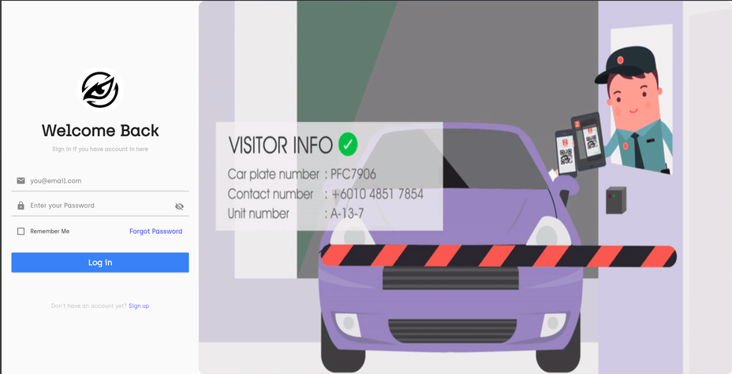
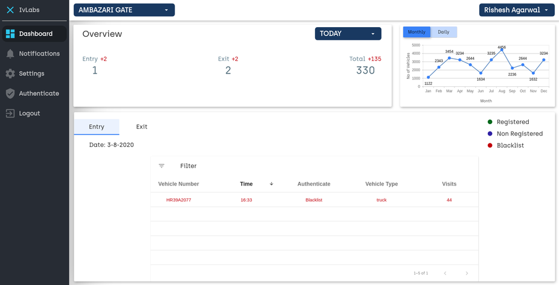
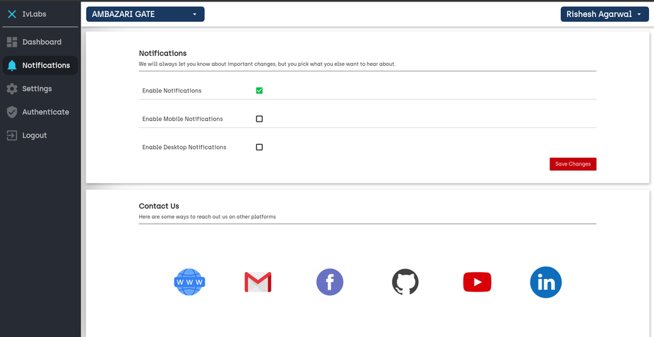

# Falcon Vision Web Application

  

This is the implementation of the web application for Smart India Hackathon (Software Edition 2020). The [problem statement](https://sih2020.sih.gov.in/nodal-centers/prin-l-n-welingkar-institute-of-management-development-research-weschool/) demands the automation of number plate detection, identification and monitoring in different scenarios. 

The database with the registered entry will be presented in a neat and user-friendly web app for recording the influx/outflux of vehicles in society.

## Firebase

The firebase integrates the number plate detection algorithm with the web application to reflect any dynamic changes in the main pipeline such as mapping the detected number plate with the registered user details. Working details can be found [here](https://drive.google.com/file/d/1d5iCLz8caoTTKYYxlhKmf1rZWejHspYS/view?usp=sharing)

## Salient Features

1. **Interactive Login and Registration**: Login can be done by admin to oversee any unauthorised entries, whereas public login for people to track vehicle activity.

2. **Dashboard**: Displays an overview of the number of entries/exits of vehicles through a gate, which is visualized on a monthly/daily basis with a line chart. Each vehicle is associated with its vehicle number, time of entry/exit, whether it was authorized to be in the locality, vehicle type as well as the number of visits made in the past.

3. **Notifications**: Provides an interactive interface, that lets the user decide the occurrence of notifications regarding any activity of their vehicle.

4. **Settings**: For the user to set up the account for his/her car as well as the account credentials and gate accesses. Up to two users can be added to the account.

5. **Add or Block User**: Allows the authority or consumer to Add or Block a particular vehicle 

The final interface working can be found [here](https://drive.google.com/file/d/1BMA6nsOvdXIhl4wpWVG8JOcQKpyvZRZE/view?usp=sharing)
